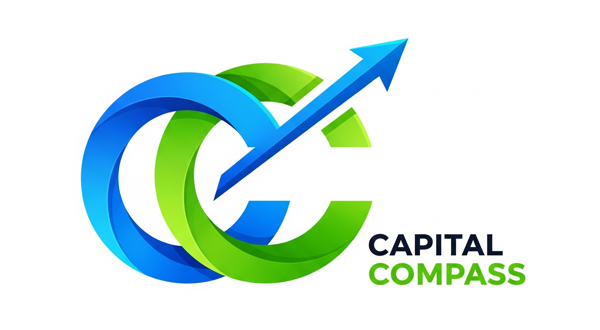
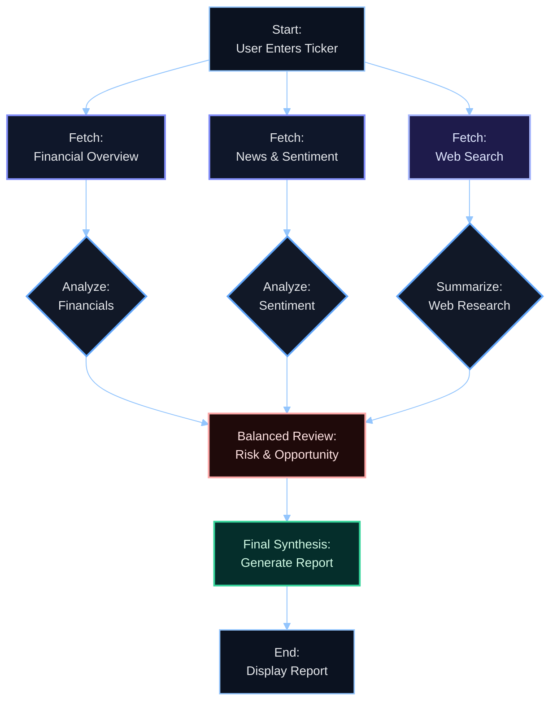

<p align="center">
  
</p>

<h1 align="center">Capital Compass 🧭</h1>

<p align="center">
  <strong>An AI-powered investment research application that generates comprehensive financial reports by synthesizing market data and news sentiment using a multi-agent workflow.</strong>
</p>

<p align="center">
  
  
  
  
</p>

---

## 📜 About The Project

**Capital Compass** is an advanced tool designed to automate and enhance the tedious process of investment research.  
By entering a stock ticker, users can generate a detailed, professional-grade financial report in seconds.  

The application leverages a sophisticated **multi-agent system** built with **LangGraph** to perform parallel data fetching, specialized analysis, critical review, and final report synthesis—providing a balanced and data-driven investment thesis.

---

## ✨ Key Features

- **AI-Powered Analysis** – Multiple specialized LLMs for financial analysis, sentiment analysis, and final reporting ensure nuanced, high-quality output.  
- **Comprehensive Data Synthesis** – Combines **quantitative financial metrics** from Alpha Vantage with **qualitative news sentiment** for a holistic view.  
- **Robust Agentic Workflow** – Implements multi-step reasoning: specialist agents analyze, a "critic" agent challenges, and a final "advisor" synthesizes into a balanced report.  
- **Decisive Recommendations** – Designed with advanced prompting techniques to overcome neutrality bias and provide clear, actionable insights.  
- **Interactive UI** – A clean, intuitive interface built with **Streamlit**.  

---

## 🚀 Live Demo


---

## 🛠️ How It Works (Architecture)

The core of **Capital Compass** is a **stateful graph built with LangGraph**. This orchestrates a sophisticated workflow between specialized AI agents to ensure a robust and nuanced analysis.


### 1. Parallel Information Gathering
The process begins by simultaneously gathering three distinct types of information:

- 📊 **Financial Overview**: Fetches quantitative financial data from **Alpha Vantage**.  
- 📰 **News & Market Sentiment**: Fetches qualitative news and sentiment from **Alpha Vantage**.  
- 🔍 **Forward-Looking Insights**: Performs a targeted **web search** for analyst ratings and price targets.  


### 2. Specialized Analysis
The raw data is then processed in parallel by three specialist agents:

- 👨‍💼 **Financial Analyst Agent** → Interprets financial metrics.  
- 🧠 **Sentiment Analyst Agent** → Evaluates news and market perception.  
- 🌐 **Web Research Agent** → Summarizes findings from the web search.  


### 3. Balanced Review
All three analyses are passed to the **Risk & Opportunity Analyst**.  
- 🎯 **Role**: Distill everything into:
  - The **most compelling reason to invest**.  
  - The **most significant risk**.  


### 4. Final Synthesis
Finally, the **Senior Advisor Agent** receives:
- The specialist analyses  
- The balanced review  

It then weighs the **core opportunity** against the **significant risk** to produce a **structured, decisive investment report**.

---
## 🎯 Workflow Diagram


```mermaid
%%{init: {
  "theme": "dark",
  "themeVariables": {
    "primaryColor": "#0b1220",
    "primaryTextColor": "#E5E7EB",
    "primaryBorderColor": "#93C5FD",
    "lineColor": "#93C5FD",
    "tertiaryColor": "#111827",
    "fontSize": "14px",
    "fontFamily": "Inter, ui-sans-serif, system-ui, -apple-system, Segoe UI, Roboto"
  }
}}%%

graph TD
    A[Start:<br/>User Enters Ticker] --> B[Fetch:<br/>Financial Overview]
    A --> C[Fetch:<br/>News & Sentiment]
    A --> I[Fetch:<br/>Web Search]

    B --> D{Analyze:<br/>Financials}
    C --> E{Analyze:<br/>Sentiment}
    I --> J{Summarize:<br/>Web Research}

    D --> F[Balanced Review:<br/>Risk & Opportunity]
    E --> F
    J --> F

    F --> G[Final Synthesis:<br/>Generate Report]
    G --> H[End:<br/>Display Report]

    %% Dark-friendly styles
    classDef fetch fill:#0F172A,stroke:#818CF8,color:#E5E7EB,stroke-width:2px
    classDef websearch fill:#1E1B4B,stroke:#A5B4FC,color:#E0E7FF,stroke-width:2px
    classDef analyze fill:#111827,stroke:#60A5FA,color:#E5E7EB,stroke-width:2px
    classDef critic fill:#1F0A0A,stroke:#FCA5A5,color:#FEE2E2,stroke-width:2px
    classDef final fill:#052E2B,stroke:#34D399,color:#D1FAE5,stroke-width:2px
    classDef default fill:#0B1220,stroke:#93C5FD,color:#E5E7EB,stroke-width:1.5px

    class B,C fetch
    class I websearch
    class J analyze
    class D,E analyze
    class F critic
    class G final

```

---

## 💻 Technology Stack

- **Frontend**: Streamlit  
- **AI Orchestration**: LangChain / LangGraph  
- **LLM Provider**: Groq (multi-model support)  
- **Data Source**: Alpha Vantage API  
- **Core Language**: Python  

---

## ⚙️ Setup and Installation

Follow these steps to get a local copy running:

### Prerequisites
- Python **3.11+**  
- Alpha Vantage API Key  
- Groq API Key  

### Installation

Clone the repository:
```bash
git clone https://github.com/ChidambaraRaju/capital-compass
cd capital-compass
```

Create a virtual environment:
```bash
python -m venv .venv
source .venv/bin/activate  # On Windows: .venv\Scripts\activate
```

Install dependencies:
```bash
pip install -r requirements.txt
```

Set up environment variables:

Create a `.env` file in the project root with:
```bash
ALPHAVANTAGE_API_KEY="YOUR_ALPHA_VANTAGE_KEY"
GROQ_API_KEY="YOUR_GROQ_API_KEY"
TAVILY_API_KEY = "YOUR_TAVILY_API_KEY"
```

---

## ▶️ Usage

Run the Streamlit app from the root directory:
```bash
streamlit run main.py
```

---

## 📁 Project Structure

```
.
├── assets/
│   └── logo.png
├── capital_compass/
│   ├── agents/
│   │   ├── analysis_agents.py
│   │   └── data_fetcher.py
│   ├── tools/
│   │   ├── alpha_vantage_client.py
        └── tavily_search_tool.py
│   ├── exceptions.py
│   ├── graph.py
│   └── state.py
├── .env
├── main.py
└── requirements.txt
```

---

## 📄 License

Distributed under the **MIT License**. See [LICENSE](LICENSE) for more information.

---

## ✨ Acknowledgements

- [Groq](https://groq.com/)  
- [Alpha Vantage](https://www.alphavantage.co/)  


<p align="center">Made with ❤️ and Python </p>
