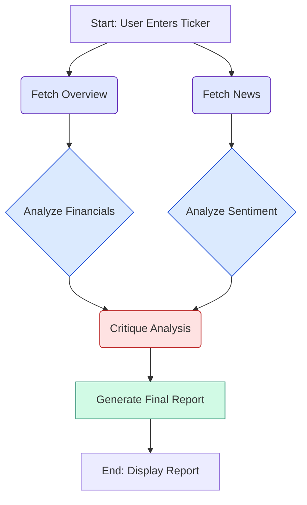

<p align="center">
  
</p>

<h1 align="center">Capital Compass 🧭</h1>

<p align="center">
  <strong>An AI-powered investment research application that generates comprehensive financial reports by synthesizing market data and news sentiment using a multi-agent workflow.</strong>
</p>

<p align="center">
  
  
  
  
</p>

---

## 📜 About The Project

**Capital Compass** is an advanced tool designed to automate and enhance the tedious process of investment research.  
By entering a stock ticker, users can generate a detailed, professional-grade financial report in seconds.  

The application leverages a sophisticated **multi-agent system** built with **LangGraph** to perform parallel data fetching, specialized analysis, critical review, and final report synthesis—providing a balanced and data-driven investment thesis.

---

## ✨ Key Features

- **AI-Powered Analysis** – Multiple specialized LLMs for financial analysis, sentiment analysis, and final reporting ensure nuanced, high-quality output.  
- **Comprehensive Data Synthesis** – Combines **quantitative financial metrics** from Alpha Vantage with **qualitative news sentiment** for a holistic view.  
- **Robust Agentic Workflow** – Implements multi-step reasoning: specialist agents analyze, a "critic" agent challenges, and a final "advisor" synthesizes into a balanced report.  
- **Decisive Recommendations** – Designed with advanced prompting techniques to overcome neutrality bias and provide clear, actionable insights.  
- **Interactive UI** – A clean, intuitive interface built with **Streamlit**.  

---

## 🚀 Live Demo

_Coming soon..._

---

## 🛠️ How It Works (Architecture)

The core of Capital Compass is a **stateful graph built with LangGraph**. This orchestrates data and logic between AI agents, ensuring structured and robust analysis.

1. **Parallel Data Fetching** – Simultaneously pulls financial overview and news sentiment from Alpha Vantage.  
2. **Specialized Analysis** –  
   - *Financial Analyst Agent*: Deep dives into quantitative metrics.  
   - *Sentiment Analyst Agent*: Evaluates qualitative news & market perception.  
3. **Critical Review** – A *Critic Agent* challenges both analyses to identify weaknesses, risks, or contradictions.  
4. **Final Synthesis** – A *Senior Advisor Agent* combines all inputs into a decisive investment report.  

### Workflow Diagram



---

## 💻 Technology Stack

- **Frontend**: Streamlit  
- **AI Orchestration**: LangChain / LangGraph  
- **LLM Provider**: Groq (multi-model support)  
- **Data Source**: Alpha Vantage API  
- **Core Language**: Python  

---

## ⚙️ Setup and Installation

Follow these steps to get a local copy running:

### Prerequisites
- Python **3.11+**  
- Alpha Vantage API Key  
- Groq API Key  

### Installation

Clone the repository:
```bash
git clone https://github.com/your_username/capital-compass.git
cd capital-compass
```

Create a virtual environment:
```bash
python -m venv .venv
source .venv/bin/activate  # On Windows: .venv\Scripts\activate
```

Install dependencies:
```bash
pip install -r requirements.txt
```

Set up environment variables:

Create a `.env` file in the project root with:
```bash
ALPHAVANTAGE_API_KEY="YOUR_ALPHA_VANTAGE_KEY"
GROQ_API_KEY="YOUR_GROQ_API_KEY"
```

---

## ▶️ Usage

Run the Streamlit app from the root directory:
```bash
streamlit run main.py
```

---

## 📁 Project Structure

```
.
├── assets/
│   └── logo.png
├── capital_compass/
│   ├── agents/
│   │   ├── analysis_agents.py
│   │   └── data_fetcher.py
│   ├── tools/
│   │   └── alpha_vantage_client.py
│   ├── exceptions.py
│   ├── graph.py
│   └── state.py
├── .env
├── main.py
└── requirements.txt
```

---

## 📄 License

Distributed under the **MIT License**. See [LICENSE](LICENSE) for more information.

---

## ✨ Acknowledgements

- [Groq](https://groq.com/)  
- [Alpha Vantage](https://www.alphavantage.co/)  


<p align="center">Made with ❤️ and Python </p>
